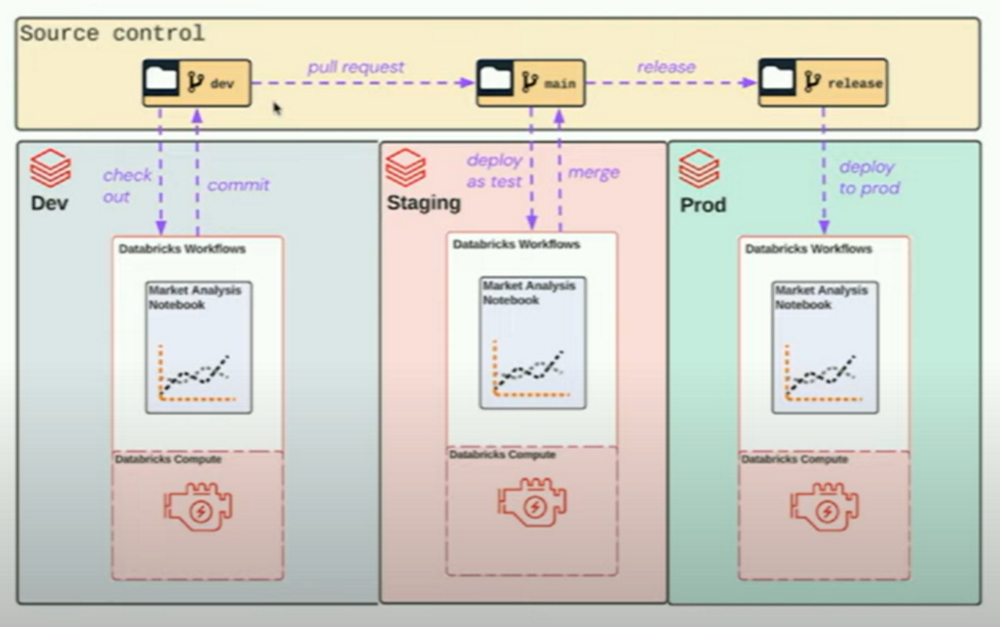
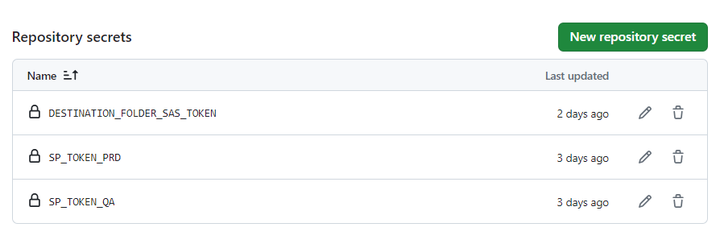

# CI/CD OAMLOPS

Continuous integration and continuous delivery of the oamlops procedure are carried out.

## Proces Description

 Here you have to put a description of what the process does with some image

## CI/CD Plan
As a continuous integration, the first plan has been decided to use a GitHub repository not shared with other projects. In which is the code and the necessary notbooks to execute the steps defined by the oamlops team

### Actions:

1. **Development**: The developer must create a new branch from the main or master branch. You will make the changes to your branch and create a pull request to the main branch to incorporate the changes.

2. **Pull request**: When a pull request is created, a Github action file will be executed that will create the necessary resources in an existing databricks workspace and will test the entire process for a single session.

3. **Verifications**: It will be verified that all processes have completed correctly and without errors. It will be verified that the results are those expected by the process and its performance will be evaluated.

4. **Merge**: Once the validations work correctly, the code is copied to the main branch

5. **Release**: When the release is made, some tests will be carried out in the production environment

 tests yet to be decided 

  

## Requirements to configure the environment (CI)

## Add environment variables:

You should create the following variables in Guthub as secret environment variables

Tocken para los diferentes entornos de databricks:
SP_TOKEN_PRD
SP_TOKEN_QA

  

# Pull Reques (PR) - GitHub Action file

**pr_action** file is ready to boot when a PR is made to the main branch of the repository

